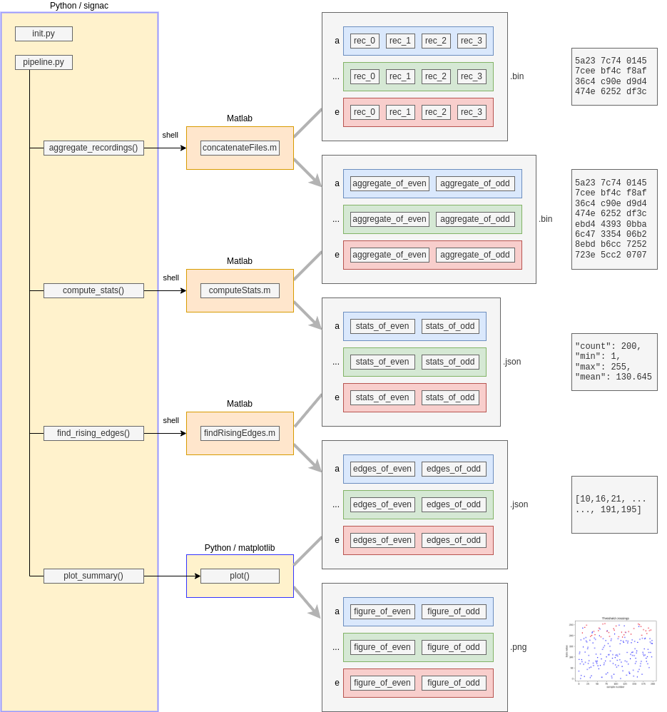

# signac-poc
Proof of concept for working with Python, signac, and Matlab.

This repo contains code and commentary about using signac to do a proof of concept for neural data analysis pipelines that use Matlab and Python.  [Signac](https://signac.io/) is a Python-based tool for managing data and running analysis workflows / pipelines.

This README covers:
 - Setup for Python, signac, and Matlab
 - Overview of sample data and analysis pipeline
 - Musings on pipelines and signac

## Python Setup

I used conda to manage my Python environment and obtain Python dependencies.  Here's the [conda installation docs](https://conda.io/projects/conda/en/latest/user-guide/install/index.html).

With conda I set up to use signac and matplotlib.
```
conda config --add channels conda-forge
conda create --name signac signac signac-flow
conda activate signac
pip install matplotlib
```

## Matlab Setup

I installed and activated Matlab R2022b locally and added `R2022b/bin` to my path.  This allows signac to invoke matlab using just the executable name `matlab`.

## Sample data and analysis -- overview.

Here's an overview of the sample data and analysis from this proof of concept pipeline.



Summary:

 - We generate some binary data files with random byte values.
 - We use Python and signac to locate all these files and process them in several steps.
 - For some of these steps, we call out to Matlab via the shell and let Matlab do the work.
 - For the final step, we combine raw data with the results of Matlab analysis to create plots, using Python and matplotlib.


## Sample data and analysis -- running it.

We'll run all the commands here `signac` conda environment we created above, from the root folder of this `signac-poc` repository.
```
conda activate signac
cd signac-poc
```

### Fake Recording Data

Generate some random data to work with.

```
python fake_recordings.py
```

This will produce a `recordings` dir, with several subfolders and binary files.  The subfolders have letter names like `a`, `b`, `c`, etc.  Each one represents a "sesssion" of multiple recordings.

Within each session folder are several binary files with names like `rec_0.bin`, `rec_1.bin`, `rec_2.bin`, etc.  Each of these represents an individual "recording" of data.  In reality each one contains 100 pseudorandom byte values, uniform over 0-255.

### Signac Init

Create a signac project that knows about the fake recording data.

```
python init.py
```

This iterates over the letter-named sessions and binary recording files created above.  For each one it creates a signac "job" which is signac's way of accounting for unique things to process.  In this case, the jobs are unique by session name and recording index.

This also adds some metadata to each job to help with things like:

 - wrangling data files and logs that we'll produce during analysis
 - grouping recordings into aggregates, based session and even vs odd recording index

The results of all this end up in a new `workspace` dir.  This is where signac keeps track of the unique jobs to process.

### Signac Analysis

Analyze the data above by running our signac "project".

```
python pipeline.py run -o analyze_aggregates
```

This tells signac to `run` the analysis that's defined in `pipeline.py`, specifically the operation called `analyze_aggregates`.  Here's what it does:

 - `aggregate_recordings()` -- Group together recordings from the same session, and having the same parity (odd vs even recording index).  This is a placeholder for other groupings we might want to do.  For each group, concatenate the recording files, in index order, into a sigle aggregate file.  To do this, we call Matlab and use the script `concatenateFiles.m`.
 - `compute_stats()` -- For each aggregate, scan over the binary byte data and compute some statistics like min and max.  This is a placeholder for other data preprocessing we might want to do.  This also happens in Matlab, with the script `computeStats.m`.
 - `find_rising_edges()` -- For each aggregate, use the stats we just computed to look for rising edges in the data, using the precomputed min and max, and an arbitrary threshold between them.  This is a placeholder for things like event detection and spike sorting.  This also happens in Matlab with the script `findRisingEdges.m`.
 - `plot_summary()` -- For each aggregate, load the raw byte data and the detected edges and produce a summary figure.  This happens in Python using `matplotlib`, using analysis results computed in Matlab.  This is an example of integrating Python and Matlab via the file system and the pipeline runner (signac), and avoids extra "bridge" code between the two environments.

## Musings on pipelines and signac

This section is about qualities of analysis pipelines that we might want to obtain or set as goals.  I'll organize these in terms of what signac seems to solve for us, vs what we'd need to implement ourselves.  This is a bit unfair to signac -- which seems like a great project -- but I hope it will be a concrete way to think about pipeline qualities.

### Things signac solves for us

#### Modular operations

- Signac breaks the pipeline into "operations" which are Python functions.
- Pre- and post-conditions give an ordering and prevent redundant computation. 

#### Durable results

- Signac encourages and makes it easy to save operation results to the file system -- rather than in memory.
- This makes results durable and keeps them in plain sight.
- We can integrate dissimilar environments like Matlab and Numpy via files without extra bridge code.
- We could "pull the plug" and restart where we left off.
- We could add an operation and run the new step from the end.
- We can re-run an operation by deleting it's output.

#### Jobs (data points) on which operations run

- Signac has the concept of a "Data space" that contains "State points".
- For example, a state point could be recordings coordinates like (session name, recording index).
- For each statepoint it creates a unique "worspace" subdir.
- This is where signac keeps track of "jobs" or data to be processed.
- Basing the workspace on the file system is how signac makes it easy to save operation results.
- It also lets signac search for results of interest with a query language.

#### No server / admin

- Signac runs locally on the local file system.
- We don't need to set up a cluster, have a cloud provider, or hire sys admins to get utility from it.
- It does have utils for submitting operations to schedulers if we ever want.

### Things we could implement along with signac

#### Integration with Matlab or other tools

- Signac has the concept of a "command" operation, which runs a shell command.
- We can use this to call matlab.
- We could build a Python utility around this to deal with poilerplate, like Matlab `-batch` and `-lofgfile` args.

#### Choice of state points

- We tell Signac what "state points" to use when setting up jobs in a workspace.
- We can choose whatever we want here, and it's not yet clear to me what's natural -- days? sessions? recordings?

#### Aggregating jobs

- We can tell signac to aggregate jobs based on some key.
- For example, maybe neural recording (channel list, recording depth).
- This works, but it seems like we then lose some utility when processing aggregates like this.
- An aggregate contains many jobs, so we're no longer 1:1 with a job folder in the workspace.
- So, it's no longer trivial to decide where to read and write results.

#### Visualizing the pipeline

Browser
- It might be useful to see an overview of the pipeline before and after running.
- There's a signac "Dashboard" module we could explore.
- However, it seems to be bare-bones and not informative by default.
- We'd need to write "Modules" which it would then display to us.

Command line
- There's a command line interface too.
- This can show tables of completed vs incomplete operations.
- It can also show progress bars.
- But this is not exactly an overview.

#### Repeatability and Provenance

- If we're going to invest in pipelines engineering, we should gain a handle on things like
  - versions of runtime environments including host, Matlab, and Python
  - versions of tools we're depending on
  - logs from each operation
  - timing around each operation
- Signac doesn't do these things automatically.
- But it has a "hooks" concept which would allow us to run code around each pipeline or operation.
- So we could write our own utils that record these facts as we go.

#### Scale out

- If we ever want to scale beyond a local workstation, Signac will integrate with popular schedulers.
- However, it's not clear how we should think about job state in this case.
- Signac's key feature is making it easy to use the local file system to wrangle job info and status.
- It seems like it'd be up to us to build a solution that works with a distributed file system.

### Where signac felt in the way or confusing

#### Sharing code

- I'm not sure how we should think about sharing code with signac.
- We can share a repo of signac code, like we share other code.
- But we don't gain a new insight into sharing from signac.
- And we'd need to be good about conventions so we don't mix local job state with shared code.

#### Declarative workflows

- I would like to have a declarative workflow definition:
  - Use v1 of this tool to run this command
  - Then use v8 of this tool to run this command
  - etc...
- With signac the workflow is implicit from a bunch of regular, imperative Python code.
- This is felxible and down-to-earth.
- But it doesn't level us up in terms of project "maturity" -- things like overall clarity, ability to reason about the pipeline, ability to share, or provanance of data and tools.
- Flexibility in and of itself can turn into a mess of code to maintain.

#### Splitting and aggregating

- It was confusing figuring out how to deal with indiviual recording files vs aggregates of recording files.
- I'm still not sure I did it "right".
- It seemed natural to say each recording file is a "job".
- And it was not hard to aggregate these based on a key in order to process them together.
- But the aggregate concept seems like an afterthought.
- It lost the nice file system integration of the original "job" concept.
- So I found myself writing custom code to reinvent how to read and write results at the aggregate level.
- This made me wonder what the tool was solving for me.
- Maybe the answer is that I chose the "jobs" wrong.
- Maybe in this example the "jobs" should have been at the aggregate level to begin with.
- That's OK, but it seems heavy to have to go back and start over!
